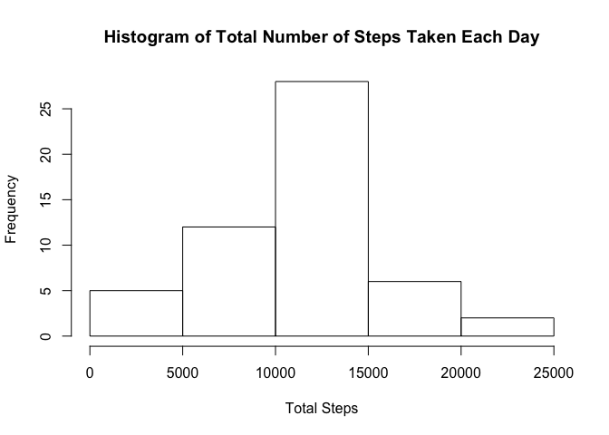
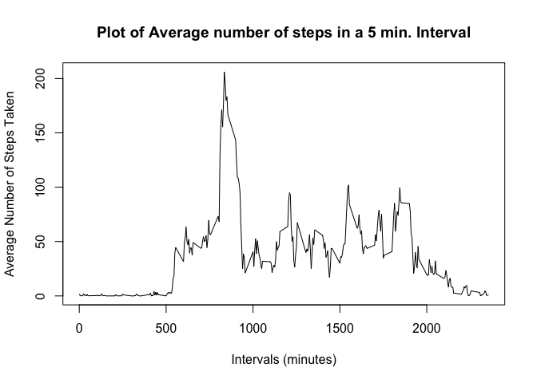
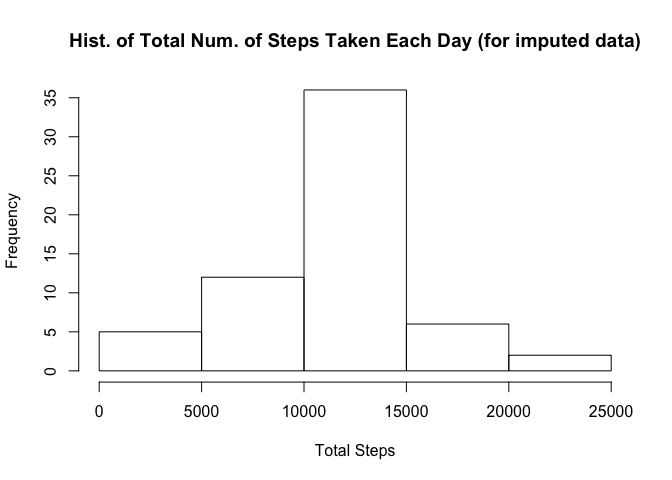
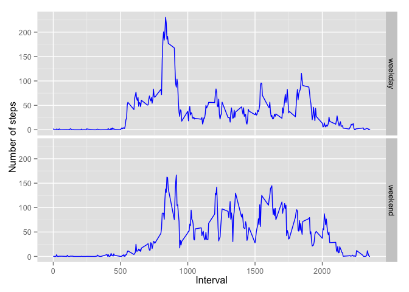

# Reproducible Research: Peer Assessment 1
+-----------+------------+
|Author     |Pankaj      |
|           |Ahire       |
+-----------+------------+
|Description|Reproducible|
|           |research,   |
|           |peer        |
|           |assessment 1|
|           |work.       |
+-----------+------------+


## Loading and preprocessing the data
The data for this assignment is the **Steps data** as outlined in the [assignment description](https://class.coursera.org/repdata-015/human_grading/view/courses/973516/assessments/3/submissions).

####Data Notes
* A zip file (_activity.zip_) was supplied containing a single CSV file with the same name.  
* Dates in the file are in `YYYY-MM-DD` format, quoted by `"` and can be parsed by explicitly setting the `colClasses` attribute of `read.csv`  
* Furthermore, since columns are few in number and the description/code book was supplied, it is easier to set `colClasses`  


```r
stepsData <- read.csv(unz("activity.zip","activity.csv"),
                                header=TRUE,
                                quote="\"", 
                                colClasses=c("numeric","Date","numeric"))
```

## What is mean total number of steps taken per day?

Note that the instructions specifically note to ignore the missing values.  
So, no special code to omit `NA` values.  

*1. Calculate the total number of steps taken per day.*  

  * I will use the `aggregate` function, which will do the calculation and return a `data.frame`. Also, it will help to set the column names of this data frame properly for subsequent analysis.  


```r
totalNumStepsPerDay <- aggregate(stepsData$steps,
                                 list(stepsData$date),
                                 sum)
names(totalNumStepsPerDay) <- c("date", "totalsteps")
```

*2. Make a histogram of the total number of steps taken each day.*  

   * This can be done with `hist` function.

```r
hist(totalNumStepsPerDay$totalsteps,
     xlab="Total Steps",
     ylab="Frequency",
     main="Histogram of Total Number of Steps Taken Each Day")
```

 

*3. Calculate and report the mean and median of the total number of steps taken per day.*  
   
   * Note that `mean` and  `median` with `NA` in the data will return `NA`. Fortunately, they come with `na.rm`.

```r
mean(totalNumStepsPerDay$totalsteps, na.rm=TRUE)
```

```
## [1] 10766.19
```

```r
median(totalNumStepsPerDay$totalsteps, na.rm=TRUE)
```

```
## [1] 10765
```
## What is the average daily activity pattern?  
*1. Make a time series plot (i.e. type = "l") of the 5-minute interval (x-axis) and the average number of steps taken, averaged across all days (y-axis)*    

   * Let's use `aggregate` again, and also give proper names. Then call `plot`.  

```r
meanBy5Min <- aggregate(stepsData$steps,
                        list(stepsData$interval),
                        mean, na.rm=TRUE)
names(meanBy5Min) <- c("interval", "stepscount")

plot(meanBy5Min$interval, meanBy5Min$stepscount,
     type="l",
     xlab="Intervals (minutes)",
     ylab="Average Number of Steps Taken",
     main = "Plot of Average number of steps in a 5 min. Interval")
```

 

*2. Which 5-minute interval, on average across all the days in the dataset, contains the maximum number of steps?*  

   * This can be obtained by using `which.max` on the `meanBy5Min` variable already calculated above.  

```r
meanBy5Min[which.max(meanBy5Min$stepscount),]
```

```
##     interval stepscount
## 104      835   206.1698
```
   Or simply:

```r
meanBy5Min[which.max(meanBy5Min$stepscount),]$interval
```

```
## [1] 835
```

## Imputing missing values

*1. Calculate and report the total number of missing values in the dataset (i.e. the total number of rows with NAs)*  

   * `complete.cases` on the original loaded dataset to the rescue here...

```r
okRows <- complete.cases(stepsData)
sum(!okRows)
```

```
## [1] 2304
```

*2. Devise a strategy for filling in all of the missing values in the dataset.*  

  * Let's use the _mean_ number of steps in a 5 minute interval to fill out the `NA` values. This strategy is the most meaningful because the 5 minute interval mean across all days is an accurate reflection of the missing values.
  
*3. Create a new dataset that is equal to the original dataset but with the missing data filled in.*  

  * We will make a copy of the original dataset and then replace the `NA` values with the mean calculated in `meanBy5Min` variable. We can do this with a simple loop for now.

```r
filledStepsData <- stepsData
notOkRows <- !complete.cases(filledStepsData)

for( i in meanBy5Min$interval) {
    filledStepsData[notOkRows & filledStepsData$interval == i, "steps"] <- 
         meanBy5Min[meanBy5Min$interval == i,"stepscount"]  
}
```
  Now `filledStepsData` has all the `NA` values filled in. We can check this by seeing if `filledStepsData` has any incomplete cases... (The answer should be `0`)
  

```r
sum(!complete.cases(filledStepsData))
```

```
## [1] 0
```

*4. Make a histogram of the total number of steps taken each day and Calculate and report the mean and median total number of steps taken per day. Do these values differ from the estimates from the first part of the assignment? What is the impact of imputing missing data on the estimates of the total daily number of steps?*  

   * A very similar code to earlier histogram.
   

```r
filledTotalNumStepsPerDay <- aggregate(filledStepsData$steps,
                                 list(filledStepsData$date),
                                 sum)
names(filledTotalNumStepsPerDay) <- c("date", "totalsteps")

hist(filledTotalNumStepsPerDay$totalsteps,
     xlab="Total Steps",
     ylab="Frequency",
     main="Hist. of Total Num. of Steps Taken Each Day (for imputed data)")
```

 

Note the effect of putting in `mean`. The overall distribution shape has not changed, however _we do see that in y-axis frequency has increased_. This is the expected effect of filling in `NA` data, since in a histogram $\text{Total Count} * \text{Frequency} = \text{Total Observations}$ and the above figure shows we have more observations now with the `NA` values replaced.  

Also, because we used mean values, the `mean` should be unaffected. `median` should not change appreciably too.


```r
mean(filledTotalNumStepsPerDay$totalsteps, na.rm=TRUE)
```

```
## [1] 10766.19
```

```r
median(filledTotalNumStepsPerDay$totalsteps, na.rm=TRUE)
```

```
## [1] 10766.19
```

We can check if the `mean` is same as before here -- `mean(filledTotalNumStepsPerDay$totalsteps, na.rm=TRUE) == mean(totalNumStepsPerDay$totalsteps, na.rm=TRUE)` evaluates to TRUE.


## Are there differences in activity patterns between weekdays and weekends?

```r
is.weekend <- function(row) {
  theday <- weekdays(as.Date(row[2],"%Y-%m-%d"),abbreviate=TRUE) 
  if( theday == "Sun" || theday == "Sat") {
    "weekend"
  } else {
    "weekday"
  }
}
filledStepsData$week <- factor(apply(filledStepsData, 
                                     1, 
                                     is.weekend))
levels(filledStepsData$week)
```

```
## [1] "weekday" "weekend"
```

Now for the panel plots.

```r
meanBy5MinByWeek <- aggregate(filledStepsData$steps,
                        list(filledStepsData$interval, filledStepsData$week),
                        mean, na.rm=TRUE)
names(meanBy5MinByWeek) <- c("interval", "week", "stepscount")
head(meanBy5MinByWeek)
```

```
##   interval    week stepscount
## 1        0 weekday 2.25115304
## 2        5 weekday 0.44528302
## 3       10 weekday 0.17316562
## 4       15 weekday 0.19790356
## 5       20 weekday 0.09895178
## 6       25 weekday 1.59035639
```

```r
library(ggplot2)
panelPlot <- ggplot(meanBy5MinByWeek, aes(x = interval, y = stepscount)) +
             xlab("Interval") +
             ylab("Number of steps") +
             geom_line(colour="blue") +
             facet_grid(week ~ .)
panelPlot
```

 

From the exploratory plots, it appears as if somewhere between `750` and `1000` minute mark there is a statistically significant activity difference between weekday and weekend. It probably corresponds to a walking activity that happens during weekdays but not on a weekend.
